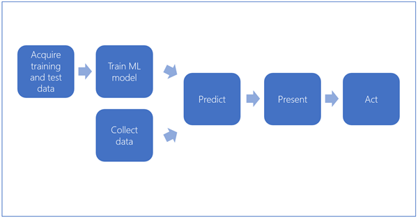
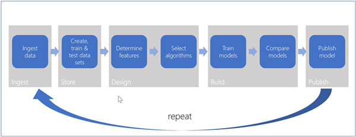
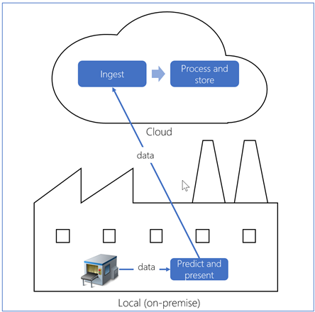
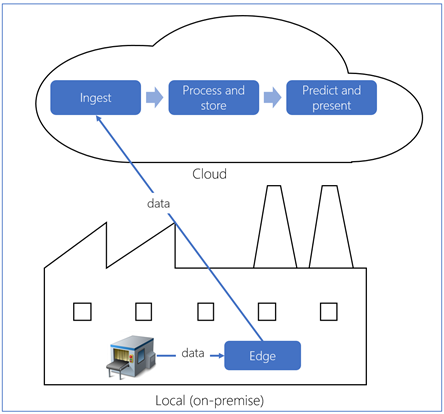
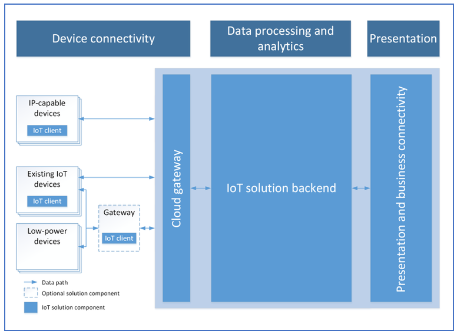
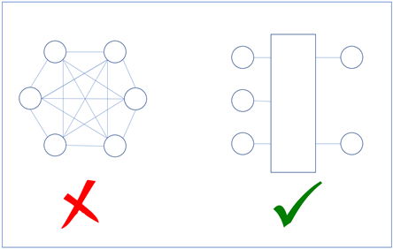
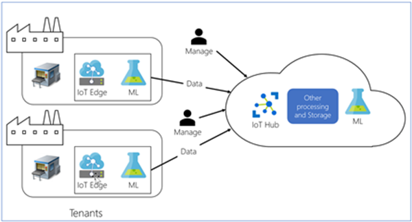

---
# required metadata
title: Predictive Maintenance Solution 
author: ercenk
ms.author: ercenk
ms.date: 05/03/2018
ms.topic: article
ms.prod: industry
description: Solution description of how to develop Predictive Maintenance (PdM) for Manufacturing customers on Azure.
---
# Predictive Maintenance in Manufacturing Solution Guide

## Introduction

This article presents approaches for building a PdM solution. The intent is not
to provide another solution architecture, but rather to present different
perspectives and reference existing materials to get you started.

Let’s start with the high-level components of a PdM solution.

In this breakdown, the following high-level activities occur:

1. Collect training data, including failure data

2. With this training data, train a Machine Learning (ML) model to predict
    future asset failures given a set of conditions

3. Continue collecting data on an ongoing basis

4. Input the collected data to the ML model, which will predict failure,
    normally with some level of confidence (for example: “there is an 85%
    probability that the machine will fail in the next 24 hours”)

5. Surface the predicted failure cases

6. Plan and act on the insights seen in the data

## Training the ML Model

Building an ML model requires sufficient, correct and complete data. In
addition, PdM poses unique challenges, a major one being the availability of
failure data. Failures are relatively rare events – particularly in high-capital
equipment, such as CNC machines, or components of oil refineries; so even if we have collected sensor data over a long period of time,
we may not have sufficient failure data. Consider how “failure” is defined; what
exactly constitutes a failure? Is it when the device stops working unexpectedly?
Is it when the device degrades to a level where it is not performing at a
desired level anymore? Is the failure case a cutting machine being destroyed,
because of a component failure caused by metal fatigue, or other indicators that
point a failure, before a catastrophe happens?

## Considering the Data Needed for ML

Consider, too, are we capturing enough data to record it these failures
properly? In many cases, sensor data alone may not be enough to identify a
failure. Sometimes we may need external data to “flag” a machine’s state as a
failure state, or a secondary source of information, such as an operator
capturing the failure case through a different system. This data may be residing
in external systems such as ERP, manufacturing execution systems (MES),
historians, etc., and cross the infamous IT/OT divide so prevalent in
manufacturing firms, making securing the necessary data extra challenging.

By nature, PdM is a dynamic problem and, as such, associated machine learning
models need to be continuously refreshed (or re-trained). If done well, PdM
should reduce the instances of failures - which is a good thing, but results in
less failure data. Also, the features that affect failure may change
invalidating prior machine learning models. We recommend training models
periodically with any changes in failure conditions.

“Fresh” data also mean new conditions brought into the model, other than the one
previously used for training the model. In other words, we may model the failure
as the function of variables _x1,x2,⋯,xn, f(x1,x2,⋯,xn)_, but eventually we
may discover variables _x(n+1),⋯,x(m+n)_ are also influencing the failure, thus
we may need to modify our model training for _f(x1,x2,⋯,x(m+n))_. The model may not be performing well for detecting the failures, and a new model may be built including data points from the machine’s MES logs as well for the next iteration.

Even without a modern IoT environment streaming data to the cloud, the data
needed to train the machine learning models may be already in your MES,
historians, or other production systems. It’s just a matter of preparing the
data so it can be used to train the machine learning models.

The following figure illustrates the typical workflow for training a ML model. The arrow
labeled “repeat” suggests that this is an iterative process – one where we are
continuously re-training the models as fresh data comes in and conditions
change. When and how often this loop needs to repeat depends on the specific
conditions of the implementation and requires careful monitoring of the
performance of the previously built models in predicting failures to detect when
models are “aging” or “degrading”.

Continuously training new models and deploying them also brings in the challenge
for managing them. Microsoft offers Azure Machine Learning Model Management
service for the CI/CD (continuous integration and continuous delivery) of
models.

Microsoft has published [a detailed
guide](https://docs.microsoft.com/en-us/azure/machine-learning/team-data-science-process/cortana-analytics-playbook-predictive-maintenance)
on how to prepare the data and train the machine learning model. There are three typical maintenance questions, and the related machine learning algorithms:

- _For the asset, what is the probability that a failure will occur within the next X hours?_ Answer: 0-100%
  - **Binary classification:** Binary classification is a machine learning method that uses data to determine the category, type, or class of an item or row of data, as a member of one of the two classes. There are multiple types of classification algorithms, Microsoft published a set of algorithms available as [Machine Learning Studio modules](https://docs.microsoft.com/en-us/azure/machine-learning/studio-module-reference/machine-learning-initialize-model-classification).
- _What is the remaining useful life of the asset?_ Answer: X hours
  - **Regression:** Regression is a class of machine learning algorithms that predict the value of a variable, given a set of other variables. Machine Learning Studio includes a set of regression algorithms as [modules](https://docs.microsoft.com/en-us/azure/machine-learning/studio-module-reference/machine-learning-initialize-model-regression).
    - **Long Short Term Memory (LSTM):** [LSTM](http://colah.github.io/posts/2015-08-Understanding-LSTMs/) networks are a type of deep neural networks (DNN). Inspiration of DNNs comes from modelling the behavior of individual neurons in the brain. Microsoft has published a [step-by-step guide](https://docs.microsoft.com/en-us/azure/machine-learning/desktop-workbench/scenario-deep-learning-for-predictive-maintenance) for describing on using an LSTM for Predictive Maintenance
- _Which asset requires servicing most urgently?_ Answer: Asset X
  - **Multi-class classification:** Multi-class classification is a machine learning method that uses data to determine the category, type, or class of an item or row of data, as a member of more than two classes.

Again, bringing in the data may mean utilizing multiple channels, initializing
it first in bulk, and then continue receiving streaming data for predicting
failures, also using it for subsequent builds of the model.

## Bringing Data to Azure

Microsoft Azure provides variety services for ingesting and storing the data. We
recommend batch methods for getting the data transferred to Azure if it is not
already there. If you can export your data as files into well-known formats,
such as csv, json, xml etc. these are good options. You may also choose to
compress them before uploading, and further process them on the cloud side.

- Upload using
    [AzCopy](https://docs.microsoft.com/en-us/azure/storage/common/storage-use-azcopy)
    to blob storage (both Windows and Linux)

- [Mount blob
    storage](https://docs.microsoft.com/en-us/azure/storage/blobs/storage-how-to-mount-container-linux)
    as a file system on Linux

- Use [Import/Export
    service](https://docs.microsoft.com/en-us/azure/storage/common/storage-import-export-service),
    if the data size is big, and takes too much time to upload

- [Mount an Azure
    File](https://docs.microsoft.com/en-us/azure/storage/files/storage-how-to-use-files-windows)
    share on Windows, Linux and MacOS

If the data is in a SQL Server database, you can also use [Data Migration
Assistant](https://docs.microsoft.com/en-us/sql/dma/dma-overview) to upload the
data to an Azure SQL Database.

There are a variety of tools and services on the Azure platform for Extract,
Transform and Load (ETL) operations. The most prominent service is the [Azure
Data Factory](https://docs.microsoft.com/en-us/azure/data-factory/) , which
provides a full set of features for manipulating data. Other options for
manipulating data are present in the many ML services available on Azure through
the open source libraries.

As for training the ML mode, Microsoft Azure provides many options, which all
can be used in different combinations.

- [Azure Machine Learning
    Services](https://docs.microsoft.com/en-us/azure/machine-learning/preview/)

- [Azure Machine Learning
    Studio](https://docs.microsoft.com/en-us/azure/machine-learning/studio/)

- [Data Science Virtual
    Machine](https://docs.microsoft.com/en-us/azure/machine-learning/data-science-virtual-machine/)

- [Spark MLLib in
    HDInsight](https://docs.microsoft.com/en-us/azure/hdinsight/spark/apache-spark-machine-learning-mllib-ipython)

- [Batch AI Training
    Service](https://docs.microsoft.com/en-us/azure/batch-ai/)

Deciding which tool to use depends on the complexity of the operations, the
team’s experience, and the size of the data.

The cost equation on cloud solutions contain many variables, in addition to the
cloud service costs, such as additional engineering, administration, data
transfers etc. Use these variables when assessing the cost, and make an informed
decision. Services only do not make up the total cost equation.

Designing the process for analyzing the data and publishing the model are
detailed subjects and differ by the technologies used. Those topics are outside
the scope of this article. A series of articles explaining the process and the
Azure services that can be used in generating the model are available. Microsoft
also provides a systematic approach for building solutions that enables teams of
data scientists to collaborate effectively over the lifecycle of the data.

Microsoft’s [Machine Learning
documentation](https://docs.microsoft.com/en-us/azure/machine-learning)
is a good starting point for exploring the options for building, deploying and
managing ML and AI models to the cloud.

The Microsoft Azure platform offers abundant choices for processing data in
scale and building ML models. The availability of almost endless, scalable
compute and storage power on the cloud platforms enable building ML and AI
models. Thus, using Azure services for building the models is the most logical
option for implementing this data flow.

## Using the Model

Once we have an ML model we need a mechanism for consuming it (or “using” it) to
predict the need for maintenance of the equipment. After the data is received
from the equipment, it moves through a processing layer to predict future
failure cases and present various means for the maintenance teams to act.

Ingesting the data can be done either online by streaming the live sensor data
into the solution, or offline by periodically importing the sensor data into the
solution.

Microsoft Azure platform provides a variety of services for ingesting,
processing and storing the data, such as:

- [Azure Event
    Hubs](https://docs.microsoft.com/en-us/azure/event-hubs/event-hubs-what-is-event-hubs)

- [Azure Service
    Bus](https://docs.microsoft.com/en-us/azure/service-bus-messaging/service-bus-messaging-overview)

- [Azure IoT
    Hub](https://docs.microsoft.com/en-us/azure/iot-hub/iot-hub-what-is-iot-hub)

- [Apache Kafka for
    HDInsight](https://docs.microsoft.com/en-us/azure/hdinsight/kafka/apache-kafka-introduction)

Unlike the process of building the ML model, consuming it does not require a lot
of computational resources. Depending on your needs, the model can be deployed
to a service in the cloud, or locally on the factory floor.

There are two main alternatives for where the ML model is executed, locally or
cloud only.

## Local Execution

The ML model is consumed locally, while data is sent
to the cloud for ingestion, storage, and further processing. This option is well
suited for scenarios where early detection is critical.

## Cloud Execution

Ingestion, process and storage, and execution of the
ML model can all take place in the Azure cloud. This option may be better suited
in cases where when sharing the results of the execution of the ML model amongst
multiple tenants or geographies (and latency is not critical). An optional
component, often referred to as “edge gateway” can be added locally to perform
some of the work - such as data aggregation and projection, stream analytics,
etc., following a pattern known as the [“Ambassador”
pattern](https://docs.microsoft.com/en-us/azure/architecture/patterns/ambassador).

There are multiple ways for using the model on Azure. [Azure Machine Learning
Web
service](https://docs.microsoft.com/en-us/azure/machine-learning/studio/consume-web-services)
is the most straightforward and uses [Azure Machine Learning
Studio](https://docs.microsoft.com/en-us/azure/machine-learning/studio/what-is-ml-studio)
as the choice for creating the model. One could also choose [Azure Machine
Learning Model
Management](https://docs.microsoft.com/en-us/azure/machine-learning/preview/model-management-overview)
which provides a comprehensive set of services for managing models, and provides
REST API endpoints, with authentication, load balancing, automatic scale-out and
encryption features. The model can be deployed to single machine (e.g. Data
Science Virtual Machine, an IoT device, a local PC) or [Azure Container
Service](https://docs.microsoft.com/en-us/azure/aks/intro-kubernetes). Once the
model is exposed through a REST API, the possibilities for using it are endless,
from custom applications to enterprise solution integration.

A cloud-only deployment does not necessarily mean there will be live steaming of
data only. A potential strategy is to periodically export data from a local
system (for example, a historian or MES), import it into the cloud system, and
present the outcome. This option may be a feasible approach when devices are not
capable of pushing data directly into the system, existing systems are already
collecting data, or no near-real-time data processing is necessary. In these
cases, there is no need to consider an edge gateway.

## Predictive Maintenance in the IoT Context

Many IoT solutions ingest and store data as part of their feature set. And as
PdM solutions often rely on IoT data, they can be a natural feature add to IoT
solutions. A crucial point to highlight in this context is the importance of
having recorded failures in the existing data to train a predictive model for
the failures.

Some use cases require near-real-time data processing. In these cases, we need a
scalable IoT solution with high data ingestion rate capabilities. The Microsoft
Azure platform provides many services that can enable solutions for highly
scalable IoT needs. [Microsoft’s IoT solution
architecture](https://docs.microsoft.com/en-us/azure/iot-suite/iot-suite-what-is-azure-iot)
on the Azure platform has logical components on three stages:

- Device connectivity

- Data processing and analytics

- Presentation

The details of the Azure IoT Solution Architecture are [available
online](http://download.microsoft.com/download/A/4/D/A4DAD253-BC21-41D3-B9D9-87D2AE6F0719/Microsoft_Azure_IoT_Reference_Architecture.pdf).
However, there are unique challenges that may arise due to the potentially
substantial number of devices connecting to backend services.

## Data Ingestion and Stream Processing

Bringing in data from the devices is a problem of communication between two
separate services; i.e. systems generating data (devices) and systems processing
this data (i.e., training the ML model, running the incoming data points against
the trained model to predict the remaining useful life).

Distributed systems, by definition, are composed of distinct components with an
inherent need to communicate with each other. One option for enabling
communication can be having related components talking directly to each other. This creates a system that is hard to
maintain and scale. As the number of components increase, it will create
_O(n2)_ complexity of communication links. A better approach is, where data is posted and read to and
from a common hub.

Injecting a new component for data ingestion makes the communication more
scalable. This component needs to be scalable, secure and most probably globally
accessible, with the option of geo-partitioning the data ingestion process. 

Considering PdM is a feature of the IoT solution. As the data streams through
the gateway, it needs to be routed to services related with PdM functionality.
Another pattern to consider is [Gateway
Routing](https://docs.microsoft.com/en-us/azure/architecture/patterns/gateway-routing).

Both patterns can be implemented using Azure service, [IoT
Hub](https://azure.microsoft.com/en-us/services/iot-hub/) and [Azure Stream
Analytics](https://azure.microsoft.com/en-us/services/stream-analytics/).

## Edge and Cloud Processing Cooperation

Not all devices and equipment can access the internet directly and consistently.
Sometimes their data needs to be pulled out from a common gateway. For example,
[MTConnect](http://www.mtconnect.org/) agents only provide a REST interface for
pulling data out.

There can be other considerations such as latency, the need to scrub device data
locally before sending it to the cloud (multitenant cases), and the need to
perform projections or aggregations on device data. The [Ambassador
pattern](https://docs.microsoft.com/en-us/azure/architecture/patterns/ambassador)
is a good approach to address these needs. [Microsoft Azure IoT
Edge](https://docs.microsoft.com/en-us/azure/iot-edge/how-iot-edge-works) is an
implementation that can act as a proxy to [Microsoft Azure IoT
Hub](https://azure.microsoft.com/en-us/services/iot-hub/), as well as provide
local processing capabilities with remote management.

A common deployment may include near-real-time
alerts on the shop floor, while still scrubbing and posting data to a
multitenant solution in the cloud for archival, model training, and
non-time-critical reporting. With Azure IoT Edge and IoT Hub’s capabilities,
customers can control the data-filtering options on the edge device, as well as
interact with other shop-floor systems to deliver alerts. 

## Multitenant Perspective

As mentioned earlier, some manufacturers or third-parties may want to deliver
PdM services to their customers. These services will most likely be offered in
multitenant cloud deployments, which present their own set of challenges:

### Data security and Isolation

The party providing a service must ensure confidential information from its
customers is identified and properly secured or scrubbed out. Microsoft Azure
provides capabilities for encrypting the data depending on the storage service
used.

The way the devices generate and submit data also needs to be secured, using
well known methods such as per-device certificates, per-device enable/disable,
TLS security, X.509 support, IP whitelisting/blacklisting, and shared access
policies. The party providing a service must ensure confidential information
from customers is identified and properly secured or scrubbed out. [Azure Data
Lake
Store](https://docs.microsoft.com/en-us/azure/data-lake-store/data-lake-store-encryption),
[Azure
Storage](https://docs.microsoft.com/en-us/azure/storage/common/storage-service-encryption),
[Azure Cosmos
DB](https://docs.microsoft.com/en-us/azure/cosmos-db/database-encryption-at-rest),
and [Azure SQL
Database](https://docs.microsoft.com/en-us/sql/relational-databases/security/encryption/transparent-data-encryption-azure-sql)
are examples of services that can be used for encrypting the data at rest. The
solution providers should also consider how to partition the data either within
the same resource (e.g. database) or multiple ones. 

### Geographical considerations

Most likely, the devices generating data will be geographically dispersed. The
solution needs provide an ingestion point closest to the data source. There
might also be times where continuous connectivity is an issue, and data may have
to be ingested in bulk, or a local store-and-forward mechanism needs to be
present.

### Scalability

Building the ML models requires compute resources that can scale elastically.
The solution provider must devise processes that make effective use of compute
resources and use the processes for scaling the solution on demand.

### Provisioning Tenants and Secure Access

The service provider needs to devise methods for effectively onboarding new
tenants and giving them means for managing their accounts by themselves. This is
also the when the decision on deployments to exclusive or shared resources are
made.

## Pillars of Software Quality Review 

Complex systems require additional scrutiny, other than fulfilling the
functional requirements. Successful cloud solutions focus on these five pillars,
scalability, availability, resiliency, management, and security. In addition to
the five pillars, we also would like to bring the cost effectiveness of the
solution.

Please see [Pillars of Software
Quality](https://docs.microsoft.com/en-us/azure/architecture/guide/pillars)
article for the details.

| Pillar                      |                                                                                                                                                                                                                                                                                                                                                                                                 |
|-----------------------------|------------------------------------------------------------------------------------------------------------------------------------------------------------------------------------------------------------------------------------------------------------------------------------------------------------------------------------------------------------------|
| Scalability                 | Most Azure services support vertical and horizontal scaling options. Take advantage of on-demand deployment of resources on the Azure platform and control their scale (size and number of instances) via automated services.                                                                                                                                                                   |
| Availability and resiliency | Compute and storage resources can be provisioned as needed elastically using many Azure services. All of the Azure services provide various levels of SLAs, however the solutions must consider and utilize the SLA levels as appropriate by using proper design principles.                                                                                                                    |
| Management                  | Azure resources may be deployed and managed by various means, such as ARM templates, command line tools and PowerShell cmdlets, and Azure Management APIs. Consider building automated solutions when managing Azure resources, instead of using tools with UIs.                                                                                                                                |
| Security                    | Azure IoT Hub supports symmetrical and asymmetrical keys (X509 certificates and TPM) over TLS. The data stores are protected using Identity and Access Management (IAM) settings and they also support encryption of data at rest. As a general high-level security checklist, consider reviewing the authorization, authentication, transport and at rest encryption, and auditing mechanisms. |
| Cost effective              | Consider provisioning resources when needed and discarding them when not in use by automation.                                                                                                                                                                                                                                                                                                  |

## Conclusion

Predictive maintenance has been a topic of discussion for a long time. Recent
developments in cloud platforms, like Microsoft Azure, enables implementers for
PdM to overcome many challenges that were obstacles in the past when dealing
with data. With the elastic scale on the compute and storage capacity, cloud
platforms present new opportunities for implementing PdM, along with new revenue
opportunities. Microsoft’s Azure platform provides many services of different
capabilities for achieving business goals of a PdM solution.

This article provided a vision for how to collect data and train data models,
along with utilizing the trained model to take action on the outcomes predicted
in the previous sections.

## Further Reading

1. [Future-focused: Stop thinking in the past and get ahead of the unexpected
    with
    IoT](https://blogs.microsoft.com/iot/2017/02/28/future-focused-stop-thinking-in-the-past-and-get-ahead-of-the-unexpected-with-iot-2/)

2. [Boost equipment reliability with IoT-enabled predictive
    maintenance](https://www.microsoft.com/en-us/internet-of-things/predictive-maintenance)

3. [Capture value from the Internet of Things: How to approach a predictive
    maintenance
    project](http://download.microsoft.com/download/0/7/D/07D394CE-185D-4B96-AC3C-9B61179F7080/Capture_value_from_the_Internet%20of%20Things_with_Predictive_Maintenance.PDF)

4. [Partner perspectives: Predictive maintenance on the
    frontlines](https://blogs.microsoft.com/iot/2017/03/21/partner-perspectives-predictive-maintenance-on-the-frontlines/)

5. [From commoditization to servitization: Transforming your business to
    compete in the new age of field service with
    IoT](https://blogs.microsoft.com/iot/2016/11/07/from-commodization-to-servitization-transforming-your-business-to-compete-in-the-new-age-of-field-service-with-iot/)
